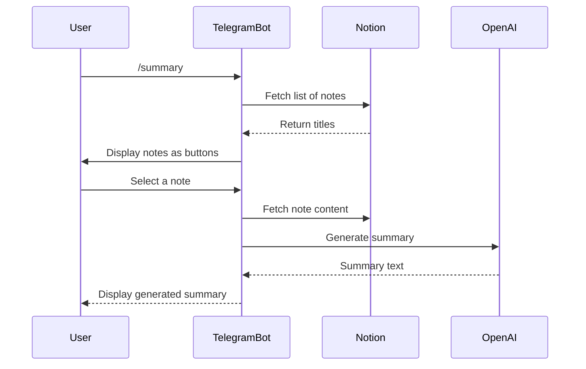
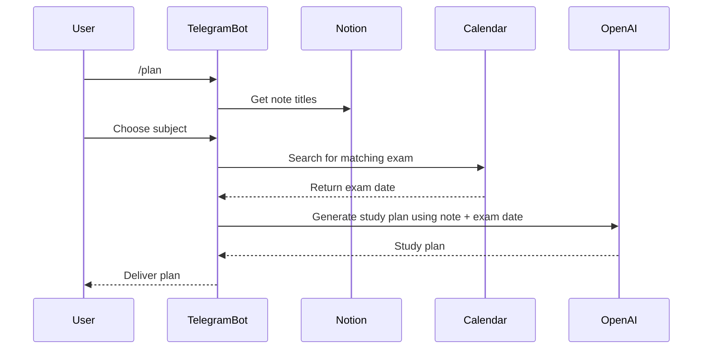
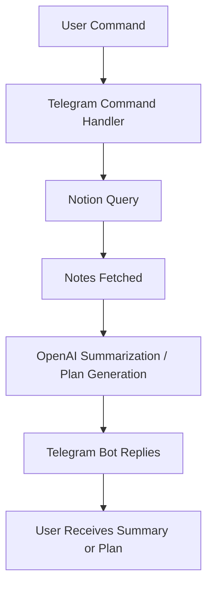

#  AI Study Companion Bot

An intelligent Telegram bot that integrates **OpenAI**, **Notion**, and **Google Calendar** to help students:

*  Summarize study notes from Notion
*  Auto-generate personalized study plans before exams
*  Fetch upcoming exam schedules from Google Calendar
*  Manage everything directly through Telegram

---

##  High-Level Overview

This bot acts as a **smart study assistant**. It connects to your **Notion database** (where you keep your notes), uses **OpenAI** to summarize and generate study plans, and checks your **Google Calendar** for upcoming exam dates.

###  Main Functionalities

| Feature                     | Description                                               |
| --------------------------- | --------------------------------------------------------- |
| `/summary`                  | Fetches your Notion notes and generates concise summaries |
| `/plan`                     | Creates adaptive study plans based on exam dates          |
| Google Calendar Integration | Automatically finds upcoming exams                        |
| Notion Integration          | Retrieves study notes and topics                          |
| OpenAI Integration          | Summarizes and generates plans                            |
| Telegram Interface          | Allows you to control everything with commands            |

---

##  System Architecture

##  Functional Flow

### **Summary Generation Flow**



---

### **Study Plan Flow**



---

##  Low-Level Details

### **1. Notion Integration**

* Endpoint: `https://api.notion.com/v1/databases/{database_id}/query`
* Purpose: Fetch notes (titles and contents)
* Authentication: Bearer token via `NOTION_API_KEY`
* Uses:

  ```python
  notion_query_database()
  get_notion_titles()
  get_notion_content_by_title(title)
  ```

---

### **2. Google Calendar Integration**

* Handles OAuth2 authentication (stores token in `token.json`)
* Fetches upcoming events (exams/tests)
* Filters events by subject similarity using token overlap and `difflib` ratio
* Uses:

  ```python
  get_calendar_service()
  search_calendar_events(subject_name)
  extract_iso_from_event(event)
  ```

---

### **3. OpenAI Integration**

* Model: `gpt-4o-mini`
* APIs Used:

  * `chat.completions.create()` for summaries and plans
  * `moderations.create()` for safety filtering
* Functions:

  ```python
  generate_summary(page_title, page_content)
  generate_plan(subject, content, exam_date_iso)
  openai_moderation_check(text)
  ```

---

### **4. Telegram Bot Handlers**

| Command        | Purpose                           |
| -------------- | --------------------------------- |
| `/start`       | Initial greeting                  |
| `/summary`     | Starts note summarization flow    |
| `/plan`        | Starts study plan generation flow |
| Callback Query | Handles inline button presses     |

---

##  Environment Variables (`.env`)

| Variable                       | Description                           |
| ------------------------------ | ------------------------------------- |
| `TELEGRAM_TOKEN`               | Telegram bot API token                |
| `OPENAI_API_KEY`               | API key for OpenAI client             |
| `NOTION_API_KEY`               | Notion integration key                |
| `NOTION_DATABASE_ID`           | ID of your Notion database            |
| `GOOGLE_CREDENTIALS_JSON_PATH` | Path to Google OAuth credentials JSON |
| `ADMIN_TELEGRAM_ID`            | Telegram ID for admin notifications   |

---

##  Modular Design Overview

| Module                     | Functionality                                  |
| -------------------------- | ---------------------------------------------- |
| `Tools`                    | Unified wrapper for Notion, Google, and OpenAI |
| `rate_limit_ok()`          | Prevents spam from users                       |
| `clean_text()`             | Sanitizes user input                           |
| `split_text_into_chunks()` | Handles Telegram message size limits           |
| `callback_query_handler()` | Main logic for inline button selections        |

---

##  Core Logic Diagram (Data Flow)



---

##  Tech Stack

| Component              | Technology                       |
| ---------------------- | -------------------------------- |
| Language               | Python 3.10+                     |
| AI Engine              | OpenAI GPT-4o-mini               |
| Database               | Notion API                       |
| Calendar               | Google Calendar API              |
| Bot Framework          | python-telegram-bot v20+         |
| Auth                   | OAuth2 (Google), .env (API keys) |
| Logging                | Python `logging`                 |
| Environment Management | `dotenv`                         |

---

##  Setup and Installation

### **1️ Clone Repository**


### **2️⃣ Install Dependencies**

```bash
pip install -r requirements.txt
```

### **3️⃣ Setup Environment**

Create a `.env` file in the project root:

```bash
TELEGRAM_TOKEN=your_telegram_token
OPENAI_API_KEY=your_openai_key
NOTION_API_KEY=your_notion_key
NOTION_DATABASE_ID=your_database_id
GOOGLE_CREDENTIALS_JSON_PATH=credentials.json
ADMIN_TELEGRAM_ID=123456789
```

### **4️⃣ Run the Bot**

```bash
python main.py
```
Execution Video link:
https://drive.google.com/file/d/1_GQU1HvyWF5anP9G7Q_rIWwdwKLsP7pS/view?usp=sharing
